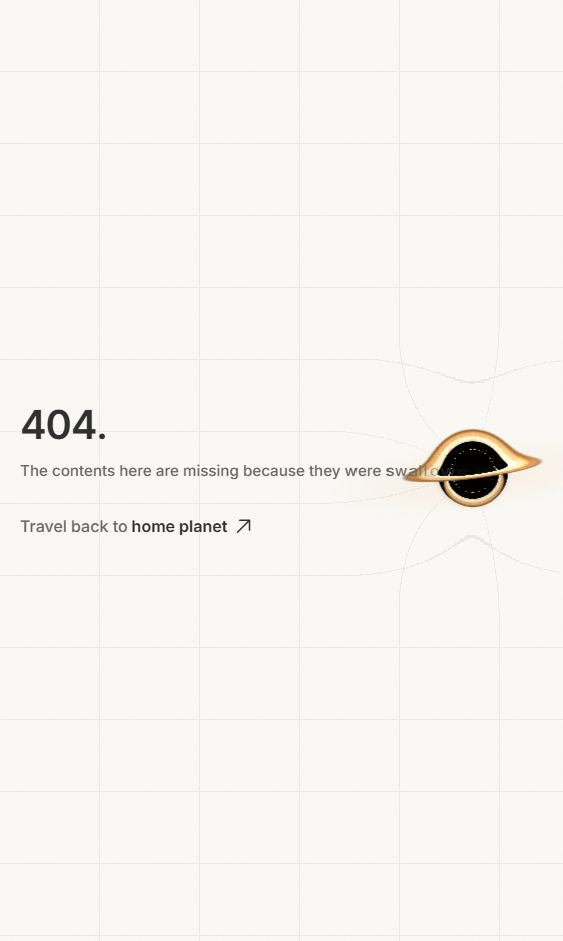
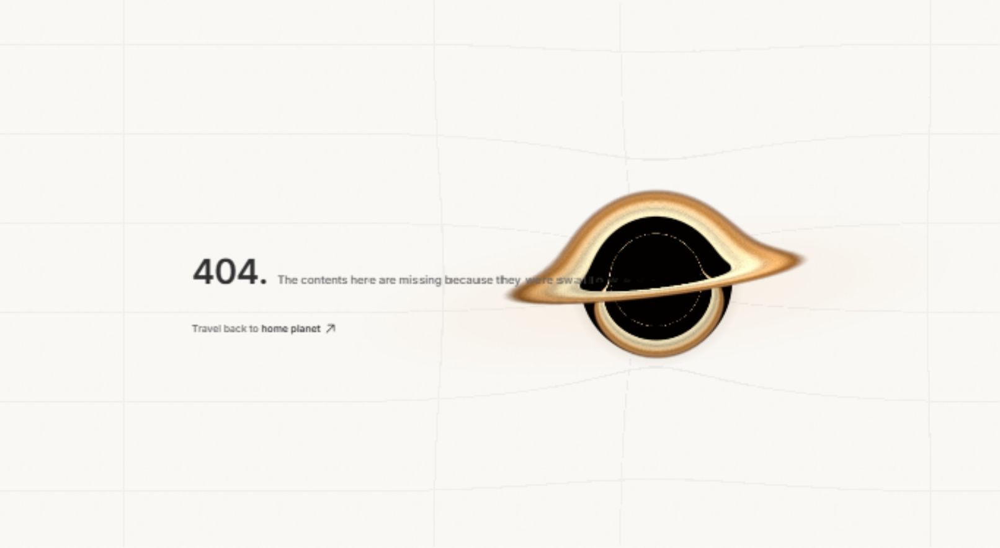
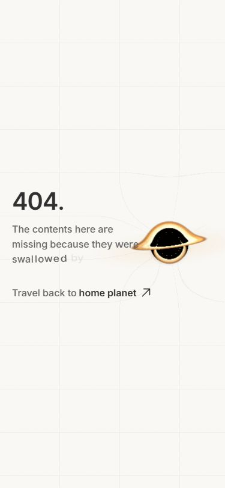
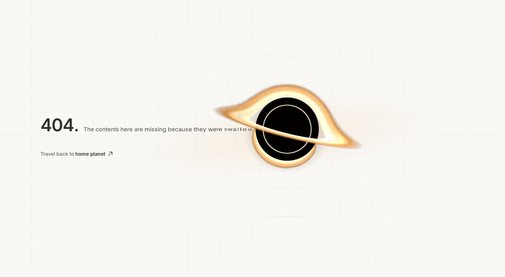
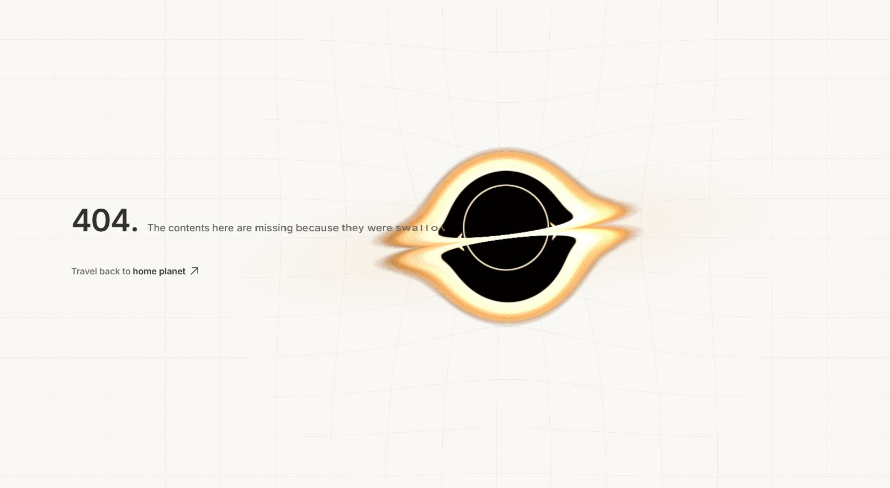
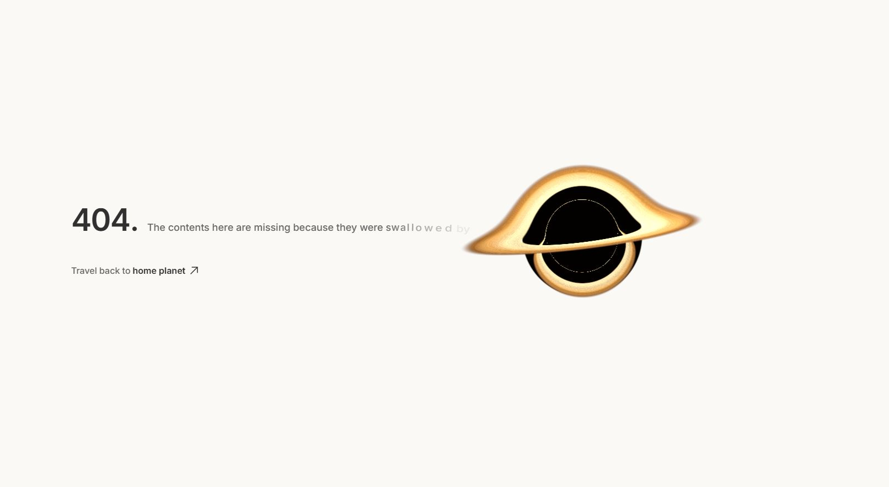
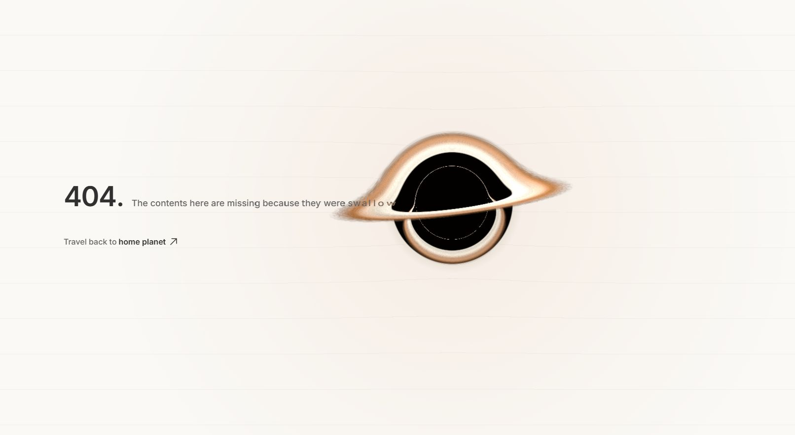
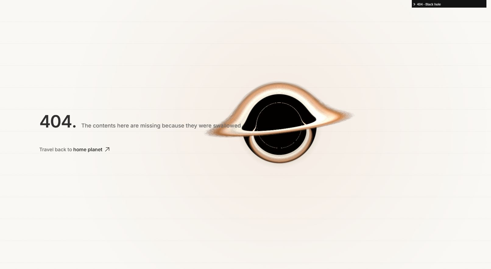
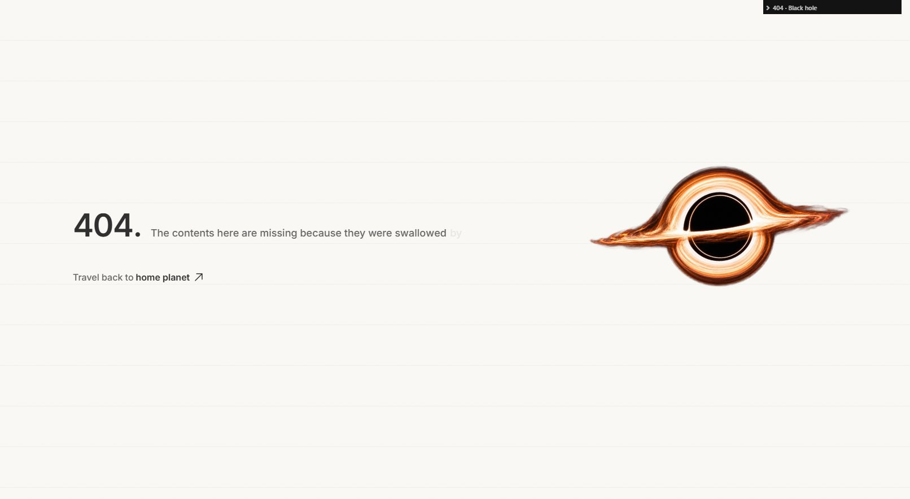
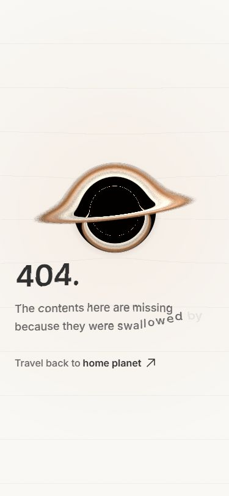

# 404 — shared page world

## Current revision — visible vertical grid strokes

The grid source now uses one repeating SVG tile with explicit horizontal and vertical paths, replacing fractional repeating-gradient strips. Horizontal strokes remain 0.6px; vertical strokes are 1.2px and have their own `verticalLineThickness` config/debug control. Grid spacing, opacity, mask and the existing shared displacement filter are unchanged. No shader, text layout, timing or warp-field changes.

Verified visible vertical strokes in the connected Chromium preview at 1612×884 and 375×812, with the grid filter still applied and no mobile overflow or captured console errors. Build and lint pass. This verifies Chromium rendering, not the user's separate Chrome window; the reported disappearance was not reproduced in that window.

## Previous revision — single-line mobile swallowing and stronger grid

The previous mobile column wrapped the sentence while placing the hole at the paragraph's right edge. It also kept the tail opaque, so the sentence and swallowing effect did not visibly connect.

- Normal mobile text now stays on one line. Layout-only measurement fits its font size to the available width after reserving the actual artwork extent, instead of reserving a fixed paragraph column. The canvas is 28vw; its centre follows the final letter, using a 4px horizon gap and 0.2 radius inset. The whole composition remains centred.
- Restored the same progressive tail fade on mobile as desktop, plus horizon-triggered feed and up to 1.24× stretch. Mobile pull remains bounded to 12px; the hole shader and grid displacement are unchanged.
- Increased grid baseline opacity from 0.06 to 0.10, with the existing 0.05 near-hole boost (0.15 near the core). Both grid directions remain on the same displaced layer.
- Full-sentence fitting means smaller type on narrow screens (about 15px at 563px, 10px at 375px, 8px at 320px). Explicit large-text preferences bypass fitting and retain wrapping; reduced motion retains opaque resting letters and zero displacement. New mobile horizon controls are in config and `?debug`.
- Chromium checks: single-line sentence and no horizontal overflow at 563px, 375px and 320px; reduced-motion playback paused with both SVG scales zero and all letters opaque; image fallback has no canvas and fits the same row. Build and lint pass, with the existing bundle-size advisory.

## Previous revision — centred composition and mobile side layout

Implemented 5 October 2026. `heroLayout.ts` centres the union of the content and actual visible artwork bounds; transparent canvas padding no longer biases placement. Both WebGL and image fallback use this layout, refreshed on resizing and font loading rather than every animation frame.

- Below the existing 768px breakpoint, the canvas reduces to 38vw and sits beside the sentence rather than above the heading. A narrower sentence column reserves 28vw for the hole, with 20px gutters. Typography is 40px for the heading and 16px/1.55 for the sentence.
- Mobile tension now points sideways toward the hole, bounded to 12px pull and 3px vertical movement. Mobile text displacement uses a 0.06 ratio to preserve reading clarity; the grid displacement, disk shader, palette, glow, grain and desktop letter behavior are unchanged.
- Responsive layout and motion values are in `config.ts` and the `?debug` Composition folder. Existing accessibility labels, unwarped home link, reduced-motion handling, visibility suspension, DPR cap and cleanup remain.
- Chromium checks: 320×568, 375×812, 768×1024 and 1612×884 have no document overflow. Reduced-motion preview has paused playback, zero displacement scales and resting letters. Forced image fallback has no canvas/filter and keeps its side placement. Build and lint pass; no browser warnings or errors were captured.

## Previous revision — version 1 look and swallowing, retained page warp

The supplied version 1 screenshot and saved early captures are the visual references. No committed copy of that 404 source exists in the repository, so this is a reference-matched reconstruction, not an exact Git rollback.

- Restored the upward -7° disk tilt, original ray-derived dark interior, naturally smaller lower reflection and faint sampled inner ring. Removed the later hard circular stencil and prominent analytic ring. Lower brightness returns to 0.72; disk exposure/saturation return to 1, with softer outer density and no added fine-streak contrast.
- The hole again overlaps the progressively faint end of the sentence. Letters stay grey, ordered and gently stretched (maximum 1.24×), rather than warming, compressing, over-stretching or disappearing at a hard core cutout. The tail fades toward 6% opacity, with the faint `by` riding its final letter. The existing 3-second breathing clock and 1.2-second entry are retained; characters are not recycled.
- Grid spacing, 220px quadratic displacement, 2.5-width falloff, text warp ratio, page glow, grain and world-update cadence are unchanged. Only the optional horizon clipping branch is disabled by default. New tail/overlap controls are in `config.ts` and `?debug`.
- Chromium reduced-motion check: paused playback, both displacement scales zero, all letters opaque and resting. Forced fallback removes the canvas/filter and leaves opaque text. Build and lint pass, with the existing bundle-size advisory.

## Previous revision — circular horizon and asymmetric disk, Chromium only

Shape-only correction after the brighter version 5 revision. The accepted grid displacement, orange elliptical glow, palette, grain, text interaction and layout settings are unchanged.

- Removed the reflected lower ray coordinates that produced the symmetric eye and duplicated white band. The original inclined disk rays now generate a dominant upper arch and naturally shorter lower arc; the lower height is approximately 64% of the upper height measured from the belt in the captured view, within the requested 55–65% range.
- A single antialiased analytic black circle is composited beneath the continuous concentric ring and near-side disk. Rear/lensed disk light is masked inside this circle. Near-side light crosses it at 86% opacity, over black rather than a transparent white gap.
- Disk geometry slopes down left-to-right by 14 degrees, with the foreground belt about 0.2 scene units below centre. `diskTiltDegrees` is separate from the accepted glow's existing `tiltDegrees`, keeping page-light settings intact. `coreRadiusRatio` and `coreBandOpacity` are also exposed in `?debug`.
- Kept lower emission at the existing brightness multiplier of 1, without mirroring its silhouette. No new ray march, render pass, RAF or dependency.

Verification: production build and lint pass (the existing large-chunk advisory remains). Chromium reduced-motion preview pauses playback, resets every letter and sets both displacement scales to zero; forced image fallback removes the canvas and grid filter. The restored active view has one canvas, the filtered loose grid and the unchanged -7° glow ellipse. The full sentence remains exposed to accessibility, and the home link remains outside the filter.

Before:

After:

## Previous revision — brighter version 5

This revision keeps version 5's grain and restores the brighter cream/gold/orange hue of stage 1. The earlier Safari sign-off note below is historical; the current requested target is Chromium only.

- Grid displacement rises to 220px with a quadratic falloff ending at 2.5 horizon widths. The real HTML row uses the same SVG approach at 35% strength to preserve reading clarity. Runtime inspection confirmed the grid has `filter: url(#…-lines)`, two repeating gradients and a populated PNG radial map.
- Added 100px vertical grid spacing. The existing 6% baseline opacity rises gently to 11% near the core on the same filtered layer.
- Orange multiply spill is a wide, tilted ellipse, with height 24% of width and its centre shifted toward the foreground band. The renderer's pulse/feed subscription is unchanged.
- The lower lensed image reuses the upper ray coordinates reflected around the foreground belt, matching its thickness and light without an extra ray march or render target. This is an artistic symmetry treatment, not a physical equivalence claim.
- The sampled dotted ring is cleaned away and replaced with an analytic, antialiased thin ring behind the foreground band. Ring radius, width, intensity and band-protection values are configurable.
- All new artistic values are in `config.ts` and `?debug`. Existing HTML accessibility, home-link behavior, saved/system reduced-motion handling, DPR cap, hidden/offscreen suspension and cleanup remain.
- Current checks: build and lint pass; no captured Chromium console errors. The reduced-motion preview has both displacement scales at zero and all letters resting. Forced fallback removes the canvas, grid filter/mask and glow styles. A 375px layout check has no horizontal overflow and keeps the home link visible. No Safari/WebKit checks were performed for this revision.

Implemented 4 October 2026. Captures use the connected Chromium-based Codex preview at 1612 × 884, except the explicitly labelled mobile check. These are live-browser screenshots, not design mockups. Motion phases vary between captures.

## Staged comparisons

### Baseline

The original art has a solid yellow/cream edge and reads independently from the plain page. The text and hole are separated vertically and horizontally.

### 1. Page bending and alignment

The desktop canvas increases from 30vw/520px to 34vw/580px. The art shares the sentence centre. Faint lines and the real HTML row receive runtime radial SVG displacement. Unlike the baseline, the page has a spatial field around the hole. The reference's strong light-bending silhouette is retained rather than replaced with a flat ring. Letter/core occlusion is intentionally left for stage 2.

### 2. Letter reaction

The tail warms and stretches along its path. An even-odd SVG core cutout replaces early alpha loss, so letters disappear only at the horizon. Subsequent radius tuning aligns this cutout more closely with the shader's rendered shadow. The reference's black centre remains dark instead of showing letters painted over it. The first letter stays anchored; characters never recycle.

### 3. Light spill

Compared with stage 2, a soft orange multiply spill tints the surrounding cream, and a circular contact shadow adds depth. The first check exposed a square gradient boundary; using a closest-side radial shadow corrected it. The reference has luminous surroundings on black; this adapts that relationship subtly to a matte cream page. Both layers share the disk pulse and feed flare.

### 4. Disk as light

The flat yellow becomes white-hot inner light, a muted orange middle and brown outer detail. Compared with stage 3, the perimeter dissolves into finer turbulent filaments, while angularly softened streaks imply rotation. The reference's upper arch, dark band and lower reflection remain; this is still an artistic approximation, not an Interstellar-accuracy physical simulation.

### 5. Shared film grain

Static 3.5% multiply grain covers both surfaces. Compared with stage 4, the page and disk share a fine texture rather than separate smooth and noisy treatments. It is deliberately subtle and adds no animated noise loop.

## Logic in simple terms

The renderer tells the page where the hole is. We build a tiny image that acts like a map of gravity: its red and green channels say how far to move each pixel sideways and vertically. SVG uses that map to bend the lines and HTML sentence, with less movement farther away. Only the map's strength pulses; the map itself is regenerated on layout changes, not every frame.

Each final letter gets more pull than the one before it. Distance controls its orange tint and stretch. A circular cutout hides pixels inside the event horizon, just as an object passing behind another object would be hidden. The same clock controls disk light, page glow and shadow. The home link is outside all this filtering and clipping.

## Verification

- Production TypeScript/Vite build and lint run after the stages.
- Connected Chromium preview: no captured console errors; SVG text and background displacement render.
- `?debug`: every new artistic/performance tuning value is exposed, including feed-flare preview.
- Reduced-motion preview: glyph transforms rest, both displacement scales are zero, playback is paused, one still canvas remains, full sentence stays in the DOM.
- Forced fallback: no WebGL canvas and no lingering filters, clip or glow/shadow positioning. The local image and unwarped sentence remain.
- Home link: outside the filtered/clipped row, current-color arrow stays part of the link; overlays have no pointer events.
- Keyboard activation with Enter successfully returns to the homepage. Responsive checks at 375 × 812, 320 × 568 and the 768 × 1024 breakpoint show no horizontal overflow; the home link stays visible.
- Mobile retains the existing below-768px stacked layout; it does not force a vertical capture stream through the heading. Desktop uses horizon entry; mobile uses bounded upward tension to preserve reading order.
- Existing DPR cap, visibility/offscreen gating and cleanup remain. New page updates use the existing renderer clock at 24Hz; map generation and silhouette reads are layout-only. No extra render target, full-page Three canvas or new dependency.
- Safari and standalone Google Chrome were not available through the connected browser tools on this Windows host. Safari rendering is therefore **not verified**. The SVG path includes explicit user-space bounds, sRGB channels and both `href`/legacy `xlink:href`. No Safari misrender was observed because Safari could not be run, so the conditional Three texture fallback was not selected. Safari testing remains necessary before cross-browser sign-off; switch to the requested Three UV path if that test exposes SVG issues.

### Reduced motion

### WebGL unavailable

### Mobile

